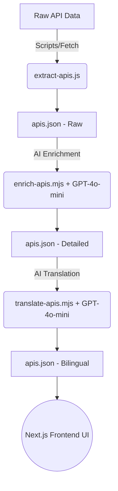

<div align="center">

# 🌐 Public APIs Explorer

**The definitive directory to find, explore, and integrate the best public APIs.**

[](https://vercel.com/new/clone?repository-url=https%3A%2F%2Fgithub.com%2FAmine-NAHLI%2Fpublic-apis-explorer)
[](https://nextjs.org/)
[](https://tailwindcss.com/)
[](https://public-apis-explorer-xi.vercel.app/)

[**🔴 Live Demo**](https://public-apis-explorer-xi.vercel.app/) • [**Report Bug**](https://github.com/Amine-NAHLI/public-apis-explorer/issues) • [**Request API**](mailto:nahli-ami@upf.ac.ma)

</div>

---

## 🎯 The Problem & The Solution

**The Problem:** Developers waste hours searching for reliable public APIs. Existing directories are often outdated, lack consistent formatting, or force you to leave the site to understand how the API works.

**The Solution:** **Public APIs Explorer** is an intelligent directory that unifies over 1,742 APIs. Each API has been automatically cleaned, detailed, and formatted using **AI (GPT-4o-mini)**. It provides ready-to-use code snippets in 5 languages (cURL, JS, Python, Node, Go) so you can integrate them instantly.

---

## ✨ Features

- 🚀 **1,742+ Verified APIs**: Search across a massive, consistently formatted database.
- 🌍 **Bilingual Native (EN/FR)**: Fully localized interface and AI-translated API descriptions.
- ⚡ **Instant Search & Filtering**: Lightning-fast filtering by Category, Auth type, HTTPS, and CORS.
- 💻 **One-Click Code Snippets**: Copy ready-to-use integration code instantly.
- ❤️ **Favorites System**: Bookmark the APIs you need (stored locally).
- 🎨 **Beautiful UI**: Dark/Light mode support with smooth Framer Motion animations.
- 📱 **Fully Responsive**: Optimized for desktop, tablet, and mobile viewing.

---

## 🏗️ Architecture & How it works

The project consists of a modern Next.js frontend and a set of powerful Node.js scripts that use OpenAI to enrich the raw data.



---

## 📦 Getting Started (Local Development)

To run this project locally on your machine:

1. **Clone the repository**
   ```bash
   git clone https://github.com/Amine-NAHLI/public-apis-explorer.git
   cd public-apis-explorer/web
   ```

2. **Install dependencies**
   ```bash
   npm install
   ```

3. **Start the development server**
   ```bash
   npm run dev
   ```
   Open [http://localhost:3000](http://localhost:3000) to view it in the browser.

---

## 🤖 AI Data Enrichment Scripts

If you want to update the API database yourself, you will need an OpenAI API key.

```bash
# 1. Fetch raw APIs
node web/scripts/extract-apis.js

# 2. Enrich with structured descriptions (Requires OPENAI_API_KEY)
$env:OPENAI_API_KEY="your_api_key"; node web/scripts/enrich-apis.mjs

# 3. Translate to French (Requires OPENAI_API_KEY)
$env:OPENAI_API_KEY="your_api_key"; node web/scripts/translate-apis.mjs
```

---

## 🗺️ Roadmap

- [x] Integrate AI for data enrichment
- [x] Bilingual Support (English / French)
- [x] Add Analytics & SEO Optimization
- [ ] Add user authentication for cloud-synced favorites
- [ ] Add an API health-check system (pinging APIs to check uptime)
- [ ] Allow community API submissions directly via UI

---

## 🤝 Contributing

Contributions make the open source community such an amazing place to learn, inspire, and create. Any contributions you make are **greatly appreciated**.

1. Fork the Project
2. Create your Feature Branch (`git checkout -b feature/AmazingFeature`)
3. Commit your Changes (`git commit -m 'Add some AmazingFeature'`)
4. Push to the Branch (`git push origin feature/AmazingFeature`)
5. Open a Pull Request

---

## 📧 Contact & Developer

**Amine NAHLI**
- LinkedIn: [Amine NAHLI](https://www.linkedin.com/in/amine-nahli-48b2a734b/)
- Email: [nahli-ami@upf.ac.ma](mailto:nahli-ami@upf.ac.ma)

Project Link: [https://public-apis-explorer-xi.vercel.app/](https://public-apis-explorer-xi.vercel.app/)

---

<div align="center">
  <i>Built with ❤️ for developers everywhere.</i>
</div>
